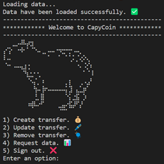
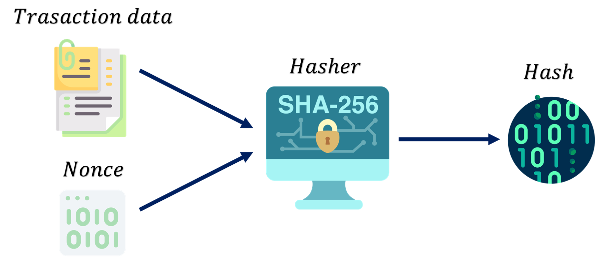
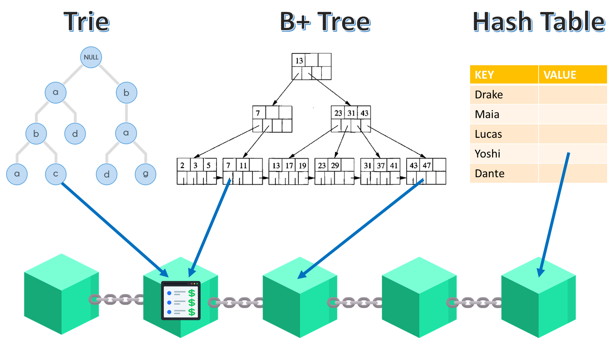
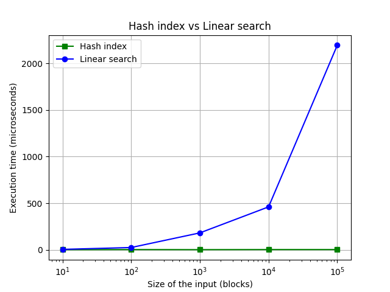
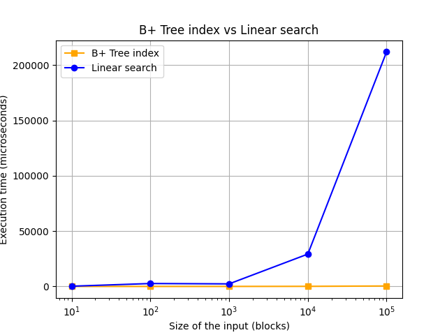
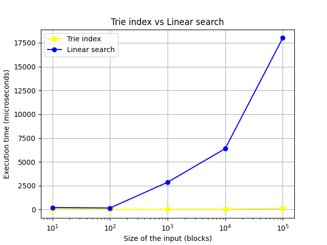

# CapyCoin Blockchain


 </img>


## 1. Introducción

Blockchain es una tecnología que ha impulsado el comercio de criptomonedas debido a su seguridad en la validación de transacciones. Siguiendo con esta tendencia, decidí crear una nueva criptomoneda llamada "CapyCoin" la cual es soportada por la Blockchain implementada en el presente proyecto. Esta hace uso de distintas estructuras de datos para la indexación y el procesamiento eficiente de consultas. Al aprovechar dichas estructuras de datos personalizadas, mi Blockchain podrá manejar grandes cantidades de datos y brindar un acceso rápido y confiable a esos datos para los usuarios y las aplicaciones creadas sobre la misma.

## 2. Objetivos
- Implementar un Blockchain que admita transacciones de criptomonedas "CapyCoin" utilizando estructuras de datos.
- Utilizar estructuras de datos de indexación como Hash tables, B+ Trees y Tries para el acceso rápido a la información contenida en la Blockchain.


## 3. Estructuras de datos de la Blockchain
Para el almacenamiento de transferencias dentro del bloque se hizo uso de un `CircularArray`:

```cpp
template <typename T, int N = 5>
class Block
{
    public:
        int id;
        int nonce;
        CircularArray<T, N> data{}; 
        string hash;
        string previous_hash;
        bool is_valid;

        Block();
        ~Block() = default;
        void insert(T feature);
        void remove(int index);
        void set_nonce(int new_nonce);
        bool mine();
        int size();

        template <typename T1, int N1>
        friend ostream& operator<<(ostream& os, const Block<T1,N1>& block);

    private:
        void update_hash();
};
```

Asimismo, los bloques en la Blockchain han sido gestionados por una `DoubleList` (lista doblemente enlazada).

```cpp
template <typename T>
class BlockChain
{
    public:
        BlockChain();
        void insert(T transfer);
        void update(T new_transfer, int id_block, int id_transfer);
        void remove(int id_block, int id_transfer);
        void display();
        int size();

    private:
        DoubleList<Block<T>*> chain;
        Block<T>* current;
        Index<T>* index;
        void create_genesis();
};
```

Estas estructuras han sido seleccionadas debido a que nos otorgan acceso rápido a los datos y permiten la ejecución eficiente de los métodos de `Block` y `BlockChain`.  

## 4. Sistema de Proof-of-work

Para resguardar la integridad de los datos, la inserción de cada bloque a la Blockchain requiere que este se encuentre minado.

A cada bloque se le asigna un código hash de acuerdo a su contenido (historial de transacciones) y el nonce haciendo uso del algoritmo criptográfico sha256, como se ilustra en la imagen:




```cpp
template <typename T, size_t N>
void Block<T, N>::update_hash()
{
    static Sha256<CircularArray<T, N>, size_t> hasher{};
    hash = hasher(data, nonce);
    is_valid = hash.starts_with("00");
}
```

Para que el bloque sea válido su código hash debe empezar con 2 ceros. De este modo, el método mine busca el nonce adecuado para que este criterio se cumpla.

```cpp
template <typename T, size_t N>
bool Block<T, N>::mine()
{
    if (!data.is_full())
        throw runtime_error("Mining a non full block is not allowed");

    size_t nonce = 0;
    const size_t MAX_NONCE = 1'000'000;

    while (nonce < MAX_NONCE) {
        set_nonce(nonce);
        if (is_valid) 
            return true;
        ++nonce;
    }
    return false;
}
```

## 5. Estructuras de datos de indexación y consultas

Para la consulta de información eficiente de la Blockchain, las transacciones han sido indexadas con distintas estructuras de datos como se muestra en la imagen:


- **search**: para esta consulta se utilizó un `ChainHash` implementado como array de `ForwardList`.
- **range_search, max_value y min_value**: para estas 3 consultas se utilizó un `B+ Tree`. 
- **starts_with**: Para esta consulta se utilizó un `Trie (Prefix tree)`.
- **contains**: Para esta consulta se utilizó el algoritmo de `Boyer Moore` con los datos almacenados en un `ForwardList`.

Todas estas estructuras de datos de indexación son gestionadas adecuadamente en la clase `Index`, encargada también de utilizarlas en las consultas de información que el usuario realice. 

```cpp
template <typename T>
class Index
{
    public:
        void create_index(Block<T>* block);
        void remove_index(Block<T>* block);
        void create_index(T* transfer);
        void remove_index(T* transfer);

        T* search(Member member, string key);
        vector<T*> range_search(double start, double end);
        vector<T*> starts_with(Member member, string prefix);
        vector<T*> contains(Member member, string pattern);
        T* max_value();
        T* min_value();

        Index() = default;
        ~Index() = default;

    private:
        BPlusTree<double, T*> amount_index;
        ChainHash<string, T*> sender_index, receiver_index;
        Trie<T*> prefix_sender_index, prefix_receiver_index;
        ForwardList<pair<string, T*>> senders, receivers;
        bool boyer_moore(string text, string pattern);
};
```


## 6. The power of indexing

A continuación, se muestran los resultados de una experimentación donde se compara el tiempo de ejecución de algunas consultas utilizando las estructuras de indexación y obviándolas realizando una búsqueda lineal. 

- **search**: Hash index vs Linear search

| Input size (blocks) | Hash index time (ms) | Linear search time (ms) |
| --------------------| -------------------- | ----------------------- |
| 10                  | 2 | 5 |
| 100                 | 3 | 25 |
| 1 000               | 2 | 182 |
| 10 000              | 3 | 461 |
| 100 000             | 3 | 2 190 |



- **range_search**: B+ Tree index vs Linear search

| Input size (blocks) | B+ Tree index time (ms) | Linear search time (ms) |
| --------------------| ----------------------- | ----------------------- |
| 10                  | 1 | 205 |
| 100                 | 3 | 2 625 |
| 1 000               | 9 | 2 308 |
| 10 000              | 84 | 29 229 |
| 100 000             | 405 | 211 980 |



- **starts_with**: Trie index vs Linear search

| Input size (blocks) | Trie index time (ms) | Linear search time (ms) |
| --------------------| ----------------------- | ----------------------- |
| 10                  | 2 | 194 |
| 100                 | 4 | 156 |
| 1 000               | 32 | 2 863 |
| 10 000              | 45 | 6 388 |
| 100 000             | 118 | 18 012 |



Este análisis empírico muestra el impacto de la indexación de datos sobre los tiempos de acceso.

## 7. Conclusiones

Culminado el presente proyecto, se llegaron a las siguientes conclusiones:
- El uso de estructuras de datos en la implementación de la Blockchain permite el óptimo performance de la aplicación bancaria.
- Estructuras de indexación permiten el acceso rápido y eficiente a los datos de la Blockchain.


## 8. Referencias bibliográficas
- Brownworth A. (2016). Blockchain 101 - A Visual Demo [Video]. YouTube. Recuperado el 30 de enero del 2022 en: https://www.youtube.com/watch?v=_160oMzblY8
- Sean Han (2017). How does blockchain really work? I built an app to show you. Recuperado el 4 de febrero del 2022 en: https://www.freecodecamp.org/news/how-does-blockchain-really-work-i-built-an-app-to-show-you-6b70cd4caf7d/


