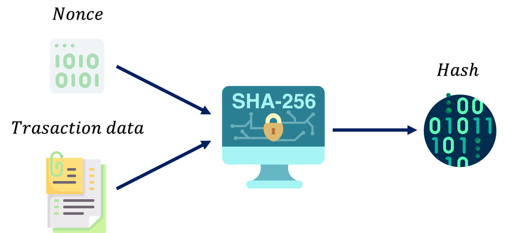

# CapyCoin BlockChain

## 1. Introduction

## 2. Objectives
- Implement a BlockChain that supports CapyCoin cryptocurrency transactions using data structures. 

## 3. Description

It allows users ...
- to register transactions in a safe way.
- make optimized queries through efficient indexing. 

## 4. Proof of work system

Computing hash

